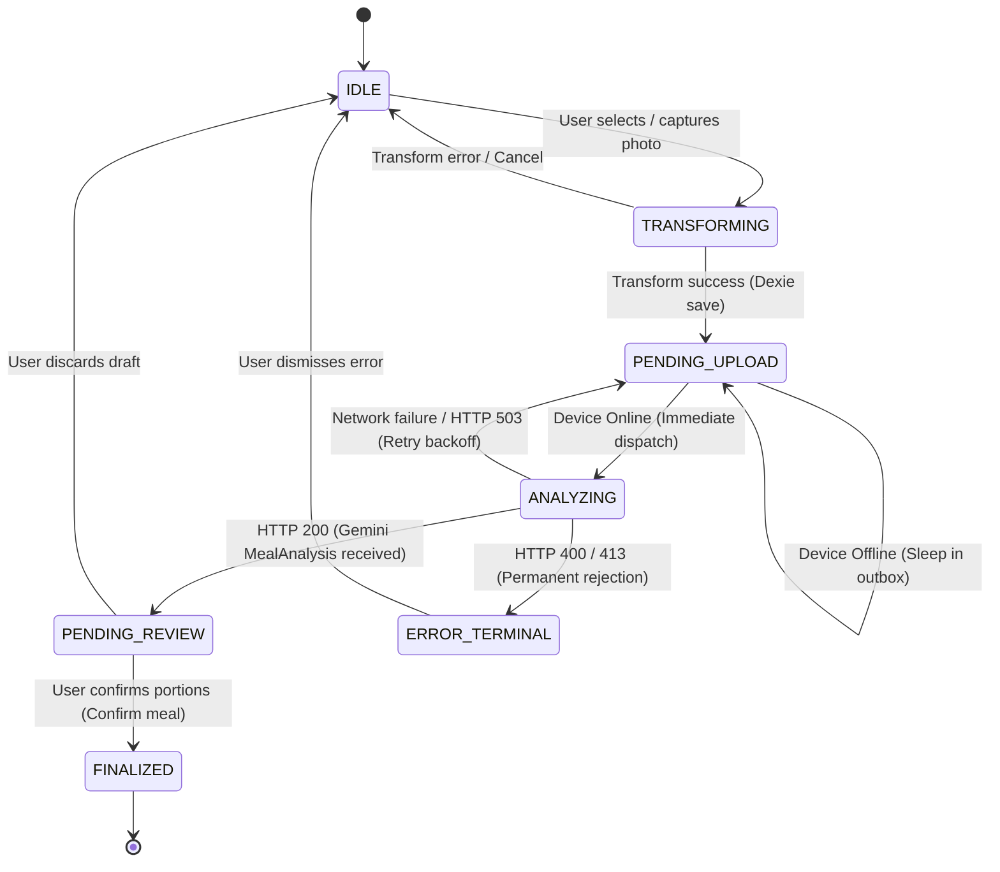

# Systems Engineering & Architecture Deep Dive
## Multimodal Nutrition Ingestion: Data Flow, Resource Constraints, and Architectural Boundaries

**Document ID:** ARCH-2026-S1  
**Project:** CalorieTracker / MacroTrack Nutrition Engine  
**Platform Target:** Progressive Web App (WebKit iOS 16.4+ / Chromium Mobile) & Django Ninja REST Backend  
**Security & Privacy Classification:** Privacy-by-Design / Zero EXIF Retention / Client-Sanitized Ingestion  

---

### Executive Table of Contents
1. [The 5 Architectural Boundaries & System Topology](#1-the-5-architectural-boundaries--system-topology)
2. [What to Understand vs. What You Can Safely Skim](#2-what-to-understand-vs-what-you-can-safely-skim)
3. [Exhaustive Architectural Decision Records (ADR 001 - ADR 008)](#3-exhaustive-architectural-decision-records-adr-001---adr-008)
   - [ADR-001: OS Hardware Delegation vs. Continuous WebRTC Stream](#adr-001-os-hardware-delegation-vs-continuous-webrtc-stream)
   - [ADR-002: In-Browser Edge Downscaling vs. Server-Side Processing](#adr-002-in-browser-edge-downscaling-vs-server-side-processing)
   - [ADR-003: Off-Thread ImageBitmap Decoding vs. FileReader Base64](#adr-003-off-thread-imagebitmap-decoding-vs-filereader-base64)
   - [ADR-004: Scoped Object URL Lifecycle vs. Data URL Previews](#adr-004-scoped-object-url-lifecycle-vs-data-url-previews)
   - [ADR-005: IndexedDB Outbox Queue vs. LocalStorage / Memory](#adr-005-indexeddb-outbox-queue-vs-localstorage--memory)
   - [ADR-006: RFC 9562 Monotonic UUIDv7 vs. Random UUIDv4](#adr-006-rfc-9562-monotonic-uuidv7-vs-random-uuidv4)
   - [ADR-007: Constrained Grammar Logit Sampling vs. Unconstrained Prompting](#adr-007-constrained-grammar-logit-sampling-vs-unconstrained-prompting)
   - [ADR-008: Human-in-the-Loop Review State Machine vs. Instant Commit](#adr-008-human-in-the-loop-review-state-machine-vs-instant-commit)
4. [Bit-by-Bit & Byte-by-Byte End-to-End Data Flow Trace](#4-bit-by-bit--byte-by-byte-end-to-end-data-flow-trace)
5. [Deep Hardware & Mobile Memory Systems Constraints](#5-deep-hardware--mobile-memory-systems-constraints)
   - [The WebKit iOS Jetsam Memory Killer](#the-webkit-ios-jetsam-memory-killer)
   - [The 48MP Uncompressed Bitmap Calculation](#the-48mp-uncompressed-bitmap-calculation)
   - [GPU Texture Buffers vs. V8 Heap Garbage Collection Realities](#gpu-texture-buffers-vs-v8-heap-garbage-collection-realities)
   - [The 4 Zero-Memory-Leak Invariants](#the-4-zero-memory-leak-invariants)
6. [Network Physics, Cellular Radio Dynamics & Server Economics](#6-network-physics-cellular-radio-dynamics--server-economics)
   - [TCP Slow Start & Cellular Uplink Asymmetry](#tcp-slow-start--cellular-uplink-asymmetry)
   - [Server Swap Thrashing & Memory Exhaustion Math](#server-swap-thrashing--memory-exhaustion-math)
   - [Gemini Vision Token Resolution Sweet Spot Analysis](#gemini-vision-token-resolution-sweet-spot-analysis)
7. [Formal Resilience, Idempotency & Error State Machine](#7-formal-resilience-idempotency--error-state-machine)
   - [Finite State Machine (FSM) Specification](#finite-state-machine-fsm-specification)
   - [Error Taxonomy & Recovery Protocols](#error-taxonomy--recovery-protocols)
   - [UUIDv7 Idempotency & Collision Analysis](#uuidv7-idempotency--collision-analysis)

---

## 1. The 5 Architectural Boundaries & System Topology

The system operates across **five strictly decoupled boundaries**, establishing clear separation between hardware sensors, client runtimes, persistence engines, network gateways, and AI inference models:

```
┌─────────────────────────────────────────────────────────────────────────────────────────┐
│ BOUNDARY 1: HARDWARE SENSOR & OS SUBSYSTEM                                              │
│ - Physical Sensor Array: 12MP-48MP Sony/Samsung CMOS, f/1.78, OIS, Multi-Lens Array     │
│ - Hardware ISP: Computational HDR, Deep Fusion, Bionic Neural Engine, Hardware Flash     │
│ - OS Intent Handoff: <input type="file" accept="image/*" capture="environment">         │
└───────────────────────────────────────────┬─────────────────────────────────────────────┘
                                            │ Raw File Pointer (8MB-15MB HEIC / JPEG)
                                            ▼
┌─────────────────────────────────────────────────────────────────────────────────────────┐
│ BOUNDARY 2: IN-BROWSER EDGE TRANSFORMATION SUBSYSTEM (Frontend Runtime)                 │
│ - Decode Engine: createImageBitmap() asynchronous decode off main UI thread            │
│ - Downscaling Pipe: Clamped aspect-ratio scaling (max 2048px) via bicubic filtering     │
│ - Privacy Sanitizer: HTML5 Canvas raster extraction (100% EXIF & GPS metadata discarded)│
│ - Encoder: Lossy WebP @ quality 0.85 (output: 300KB-400KB binary Blob)                  │
│ - Memory Hygiene: Explicit bitmap.close(), canvas zeroing, scoped revokeObjectURL()     │
└───────────────────────────────────────────┬─────────────────────────────────────────────┘
                                            │ Sanitized WebP Blob (~350KB) + UUIDv7
                                            ▼
┌─────────────────────────────────────────────────────────────────────────────────────────┐
│ BOUNDARY 3: OFFLINE-FIRST PERSISTENCE SUBSYSTEM (IndexedDB / Dexie.js)                   │
│ - Local Store: CalorieTrackerDB.meals (Status: PENDING_UPLOAD)                          │
│ - Outbox Queue: CalorieTrackerDB.outbox_queue (Serialized Blob + Client Request ID)     │
│ - Resilient Dispatcher: window.ononline & visibilitychange foreground sync drain        │
└───────────────────────────────────────────┬─────────────────────────────────────────────┘
                                            │ Binary Stream (multipart/form-data)
                                            ▼
┌─────────────────────────────────────────────────────────────────────────────────────────┐
│ BOUNDARY 4: INGESTION GATEWAY SUBSYSTEM (Django Ninja REST API)                         │
│ - Ingestion Guard: POST /api/food/analyze-food (MIME validation, 25MB ceiling)          │
│ - Zero-Swap Buffer: Direct memory stream via image.read() without host disk writes      │
│ - Idempotency Gate: X-Client-Request-Id header propagation                              │
│ - Persistence Handler: POST /api/food/confirm-meal -> MealLog OLTP record               │
└───────────────────────────────────────────┬─────────────────────────────────────────────┘
                                            │ types.Part.from_bytes() via gRPC/HTTPS
                                            ▼
┌─────────────────────────────────────────────────────────────────────────────────────────┐
│ BOUNDARY 5: MULTIMODAL FOUNDATION MODEL SUBSYSTEM (Google Gemini 3.6 Flash)             │
│ - Vision Encoder: Patch tokenization (optimal 2048px representation)                    │
│ - Constrained Grammar Sampler: Logit masking enforcing MealAnalysis Pydantic schema    │
│ - Deterministic Output: Typed JSON with macronutrients, calories, and portion weights   │
└─────────────────────────────────────────────────────────────────────────────────────────┘
```

---

## 2. What to Understand vs. What You Can Safely Skim

| What to Understand (Architectural & Systems Level) | What You Can Safely Skim / Ignore |
| :--- | :--- |
| **Why images are downscaled client-side** before touching the cellular uplink. | CSS styling, Tailwind utility classes, colors, gradients, and padding. |
| **The wire protocol, payload format, and size** reaching `/api/food/analyze-food`. | React component layout nesting and button coordinates. |
| **Memory pointer lifecycles** (`createObjectURL` and mandatory `revokeObjectURL`). | Framer Motion / CSS transition animations or spinner keyframes. |
| **Error taxonomy and state machine handling** across offline outbox queues and backend 4xx/5xx responses. | Specific canvas 2D rendering context interpolation math formulas. |
| **Idempotency with UUIDv7** preventing duplicate charges or duplicate database records. | Form state boilerplate or individual slider `<input type="range">` markup. |

---

## 3. Exhaustive Architectural Decision Records (ADR 001 - ADR 008)

### ADR-001: OS Hardware Delegation vs. Continuous WebRTC Stream

- **Context:** The application must capture a high-quality photograph of a plate of food to allow AI identification of discrete items, portion weights, and sauces.
- **Option A (Chosen):** OS Hardware Delegation via `<input type="file" accept="image/*" capture="environment">`.
- **Option B (Rejected):** Continuous WebRTC viewfinder stream using `navigator.mediaDevices.getUserMedia({ video: { facingMode: 'environment' } })`.
- **Decisive System Rationale:**
  1. *ISP Feature Access:* `getUserMedia` exposes a generic video stream in the browser sandbox. It lacks access to native smartphone computational photography: multi-camera optical switching (macro lens vs. wide lens), optical image stabilization (OIS), deep-fusion sensor binning, and hardware xenon/LED flash synchronization.
  2. *Battery & Thermal Limits:* Continuous WebRTC rendering at 30/60 FPS keeps the mobile GPU/NPU active, draining battery and causing thermal throttling. OS delegation yields process execution to the operating system's native camera app and shuts down completely while the photo is taken.
  3. *Security & Permission UX:* `getUserMedia` requires a Secure Context (HTTPS) and prompts the user with scary system permission dialogs on every new domain. `<input capture="environment">` is an OS-standard file intent that works seamlessly over local development IPs and native PWA installations without permission friction.

### ADR-002: In-Browser Edge Downscaling vs. Server-Side Processing

- **Context:** High-end smartphone cameras take photos between 12MP and 48MP, producing files between 8MB and 15MB.
- **Option A (Chosen):** In-browser edge downscaling via canvas clamping to max 2048px, encoding to WebP at 85% quality (~350KB).
- **Option B (Rejected):** Uploading the raw 15MB file and resizing on the backend using Python libraries (Pillow, OpenCV, or Sharp).
- **Decisive System Rationale:**
  1. *Cellular Asymmetry:* Mobile cellular networks (4G LTE/5G) have heavily asymmetrical bandwidth. Downlink is often 50–150 Mbps, but uplink is throttled to 2–5 Mbps. Uploading 15MB over a 3 Mbps connection requires **40 seconds of continuous radio transmission**. Uploading a 350KB WebP requires **less than 300 milliseconds**.
  2. *Server Swap & Concurrency:* 1,000 concurrent mobile uploads of 15MB files requires 15GB of raw buffer memory in server worker threads. Under high traffic, this exhausts server RAM, triggers OS swap thrashing, increases response times by 100x, and causes Out-Of-Memory container reboots.
  3. *Privacy by Design:* Photos taken by phones contain EXIF headers with camera serial numbers and exact GPS coordinates. Canvas downscaling copies only raw visual color pixels, discarding 100% of telemetry and geolocation data before bytes leave the user's phone.

### ADR-003: Off-Thread ImageBitmap Decoding vs. FileReader Base64

- **Context:** Decoding large image files into memory can freeze the browser UI and consume excessive RAM.
- **Option A (Chosen):** `createImageBitmap(file)` asynchronous decoding.
- **Option B (Rejected):** `FileReader.readAsDataURL(file)` Base64 string decoding.
- **Decisive System Rationale:**
  1. *Heap Bloat:* `FileReader.readAsDataURL` reads binary into a UTF-16 Base64 string, adding an immediate **33% memory size penalty** and allocating multi-megabyte strings inside JavaScript's V8 / JavaScriptCore heap.
  2. *Main Thread Jank:* Decoding a 48MP image on the main UI thread blocks the event loop for 400ms–800ms, causing UI stutter and dropped frames. `createImageBitmap` executes asynchronously off the main thread in native browser graphics worker processes, decoding directly into native GPU memory buffers.

### ADR-004: Scoped Object URL Lifecycle vs. Data URL Previews

- **Context:** The application must display an instant thumbnail preview of the optimized image to the user.
- **Option A (Chosen):** `URL.createObjectURL(blob)` paired with an explicit, scoped `revokePreview()` handle.
- **Option B (Rejected):** Storing Base64 Data URLs (`data:image/webp;base64,...`) in React component state.
- **Decisive System Rationale:**
  1. *Pointer vs. Payload:* A Blob URL is a lightweight 48-byte string pointer (`blob:http://...`) pointing to an internal browser memory table. A Base64 string is a 500,000-character string duplicated in JavaScript heap memory.
  2. *Leak Prevention:* Browser engines do not automatically garbage collect Blob URLs until the entire document unloads. By encapsulating the URL in a `TransformedImageResult` with a mandatory `revokePreview()` function, the `CameraCapture` component explicitly frees the native memory buffer via `URL.revokeObjectURL()` during component unmount or when the user retakes a photo.

### ADR-005: IndexedDB Outbox Queue vs. LocalStorage / Memory

- **Context:** The app must support offline food logging in cellular dead zones (e.g., basement restaurants, subways, rural areas) without data loss.
- **Option A (Chosen):** IndexedDB backed by `Dexie.js` (`meals` and `outbox_queue` tables).
- **Option B (Rejected):** Web Storage (`localStorage` / `sessionStorage`) or in-memory React state.
- **Decisive System Rationale:**
  1. *Thread Blocking:* `localStorage` is completely synchronous and runs on the main browser UI thread. Writing multi-megabyte meal records or blobs to `localStorage` blocks user interaction. IndexedDB is fully asynchronous.
  2. *Quota & Binary Support:* `localStorage` has a hard 5MB ceiling across the entire origin and only stores UTF-16 text (requiring Base64 serialization). IndexedDB can store hundreds of megabytes of raw binary `Blob` objects without serialization overhead.
  3. *Process Survivability:* In-memory state is wiped if iOS Safari unloads the tab in the background. IndexedDB persists meal drafts permanently until network connectivity returns.

### ADR-006: RFC 9562 Monotonic UUIDv7 vs. Random UUIDv4

- **Context:** Offline meals require unique client-generated identifiers for queue ordering, database primary keys, and backend idempotency deduplication.
- **Option A (Chosen):** RFC 9562 UUIDv7.
- **Option B (Rejected):** Standard Random UUIDv4 (`crypto.randomUUID()`).
- **Decisive System Rationale:**
  1. *B-Tree Index Fragmentation:* UUIDv4 is 122 bits of pure pseudo-random entropy. Inserting random keys into IndexedDB B-trees or backend PostgreSQL/SQLite indexes causes constant B-tree page splits, random disk seeks, and cache eviction.
  2. *Chronological Locality:* UUIDv7 embeds a 48-bit millisecond Unix timestamp in its most significant bits. This guarantees that keys are monotonically increasing. New meals are always appended to the right edge of B-tree index leaves, delivering sequential I/O and optimal cache locality.
  3. *Natural Chronological Sorting:* Meals sorted by `id` in IndexedDB are automatically sorted chronologically without needing secondary index lookups on timestamp fields.

### ADR-007: Constrained Grammar Logit Sampling vs. Unconstrained Prompting

- **Context:** The Gemini multimodal vision model must return clean, typed data matching the application's `MealAnalysis` schema.
- **Option A (Chosen):** Token-level constrained grammar sampling (`response_schema=MealAnalysis` in `types.GenerateContentConfig`).
- **Option B (Rejected):** Free-form prompting (`"Return JSON..."`) followed by regular expression extraction and `json.loads()`.
- **Decisive System Rationale:**
  1. *Token-Level Grammar Masking:* Unconstrained LLMs frequently wrap JSON in markdown fences (` ```json `), omit required keys, add hallucinated fields, or insert illegal trailing commas.
  2. *Grammar State Automaton:* Constrained sampling modifies the model's vocabulary logit distribution at each generation step using a finite state automaton. Tokens that violate the Pydantic schema cannot be generated. This guarantees 100% valid JSON and eliminates runtime parsing exceptions.

### ADR-008: Human-in-the-Loop Review State Machine vs. Instant Commit

- **Context:** After Gemini returns nutrient predictions, the application must decide when to save the record to the user's permanent diary.
- **Option A (Chosen):** Editable review state machine (`PENDING_REVIEW` with interactive portion sliders) requiring explicit user confirmation.
- **Option B (Rejected):** Automatically committing the AI response as `FINALIZED` directly to the database upon receipt.
- **Decisive System Rationale:**
  1. *Estimation Tolerance:* Computer vision cannot detect hidden butter, oil, sugar, or deep-dish ingredient density. Auto-committing creates user distrust when estimates diverge from reality.
  2. *Local Reactive Math:* The `MealReviewModal` implements client-side proportional macro math:
     $$\text{new\_macro} = \text{round}\left(\text{base\_macro} \times \frac{\text{new\_weight}}{\text{base\_weight}}\right)$$
     Adjusting a portion slider (e.g., 150g rice $\to$ 200g) updates calories and macros in **$< 1\text{ms}$** on the client without issuing extra network requests.

---

## 4. Bit-by-Bit & Byte-by-Byte End-to-End Data Flow Trace

The following trace details the journey of a single meal capture across all 5 architectural boundaries:

```
T0: User Interaction & Hardware Handoff
├── 1. User taps "Capture Meal" in UI.
├── 2. React triggers inputRef.current.click() on <input capture="environment">.
├── 3. Web browser yields execution to OS Camera application.
├── 4. Camera ISP captures 48MP CMOS frame (8000x6000 px, 12-bit RAW).
├── 5. OS compresses frame to 12.4 MB HEIC file with EXIF GPS metadata.
└── 6. User confirms photo; OS returns File object handle to browser.

T1: In-Browser Client Edge Transformation (imageTransform.ts)
├── 1. transformMealImage(file) receives File object (12.4 MB).
├── 2. createImageBitmap(file) spawns asynchronous decode task in browser engine.
├── 3. Image dimensions calculated: 8000x6000 exceeds maxDimension (2048px).
├── 4. Scale ratio computed: scale = 2048 / 8000 = 0.256.
├── 5. Target dimensions resolved: targetWidth = 2048px, targetHeight = 1536px.
├── 6. OffscreenCanvas(2048, 1536) allocated in graphics memory.
├── 7. ctx.drawImage(bitmap, 0, 0, 2048, 1536) renders downscaled raster.
│       └── ALL EXIF metadata, camera serials, and GPS tags are permanently discarded.
├── 8. bitmap.close() invoked immediately, releasing raw 48MP graphics handle.
├── 9. canvas.convertToBlob({ type: 'image/webp', quality: 0.85 }) compresses canvas.
├── 10. Output: 342 KB binary WebP Blob (97.2% payload reduction).
├── 11. Canvas dimensions zeroed (width = 0, height = 0) to free backing buffer.
└── 12. URL.createObjectURL(blob) generates preview URL with scoped revocation handle.

T2: Offline-First Local Storage (outboxDispatcher.ts)
├── 1. generateUUIDv7() creates monotonically ordered ID: "0191c95e-3990-7d72-9a3b-2802bcfb17ce".
├── 2. db.meals.put() saves draft record:
│       { id: "0191c95e...", status: "PENDING_UPLOAD", meal_name: "Analyzing Meal..." }
├── 3. db.outbox_queue.add() serializes 342 KB WebP blob into IndexedDB.
├── 4. Effective network check evaluated:
│       ├── If OFFLINE: UI reflects "Meal Saved Offline"; queue dispatcher sleeps.
│       └── If ONLINE: Background upload dispatched immediately.

T3: Network Ingestion & Streaming (Django Ninja)
├── 1. Client creates FormData instance; appends image Blob.
├── 2. HTTP POST dispatched to /api/food/analyze-food with header:
│       X-Client-Request-Id: 0191c95e-3990-7d72-9a3b-2802bcfb17ce
├── 3. Django Ninja verifies Content-Type matches image/* and size <= 25MB.
├── 4. image.read() retrieves 342 KB byte stream directly into server memory.
└── 5. Byte stream passed directly to types.Part.from_bytes() without writing to disk.

T4: Multimodal AI Inference (Gemini 3.6 Flash)
├── 1. Google GenAI Client transmits prompt + image part over gRPC/HTTPS.
├── 2. Gemini vision encoder processes image as 2048px visual tokens.
├── 3. Constrained grammar sampler enforces MealAnalysis schema during generation.
├── 4. Server receives validated JSON payload:
│       {
│         "meal_name": "Grilled Chicken Breast with White Rice and Broccoli",
│         "total_calories": 520,
│         "total_macros": { "protein_g": 48, "carbs_g": 52, "fat_g": 10, "fiber_g": 4 },
│         "food_items": [ ... ]
│       }
└── 5. Endpoint returns 200 OK to mobile client.

T5: Human-in-the-Loop Review & Finalization
├── 1. Client receives 200 OK; updates local IndexedDB record to PENDING_REVIEW.
├── 2. Dequeues completed item from outbox_queue.
├── 3. Mounts MealReviewModal with itemized portion sliders.
├── 4. User drags slider: Chicken Breast 180g -> 220g.
├── 5. Client math engine recalculates macros locally (< 1ms).
├── 6. User taps "Confirm & Log Meal".
├── 7. db.meals.update() sets status to FINALIZED.
├── 8. POST /api/food/confirm-meal syncs finalized meal to Django MealLog table.
└── 9. App re-queries db.getMealsForDate() and updates "Today's Energy" dashboard.
```

---

## 5. Deep Hardware & Mobile Memory Systems Constraints

### The WebKit iOS Jetsam Memory Killer
Mobile operating systems lack traditional swap files. On iOS, the kernel memory monitor (**Jetsam**) enforces strict resident memory ceilings on browser tabs. 

When a tab in Safari or an installed PWA exceeds approximately **300MB–400MB of resident RAM**, Jetsam issues a high-priority `SIGKILL`. The tab crashes instantly, reloading the page and destroying all in-memory application state.

### The 48MP Uncompressed Bitmap Calculation
Modern iPhone and Android cameras capture photos at up to 48 megapixels ($8000 \times 6000$ pixels). In graphics memory, an uncompressed image requires 4 bytes per pixel (Red, Green, Blue, Alpha):

$$\text{Memory} = 8,000\text{ px} \times 6,000\text{ px} \times 4\text{ bytes/px} = 192,000,000\text{ bytes} \approx \mathbf{183.1\text{ MB}}$$

If an unoptimized application processes this image carelessly:
1. Raw file kept in JavaScript memory: **15 MB**
2. Base64 encoding via `readAsDataURL()`: **20 MB**
3. DOM Canvas decode allocation: **183 MB**
4. Second canvas for downscaling: **45 MB**
5. Preview Base64 string: **5 MB**
$$\text{Total Memory Footprint} = 15 + 20 + 183 + 45 + 5 = \mathbf{268\text{ MB}}$$

A single photograph pushes the tab to **268 MB of RAM**—dangerously close to the 300MB Jetsam kill threshold. Two consecutive captures without garbage collection will reliably crash the browser.

### GPU Texture Buffers vs. V8 Heap Garbage Collection Realities
JavaScript developers often assume that garbage collection (GC) will clean up unneeded images. This assumption causes memory leaks on mobile devices:
- V8 / JavaScriptCore manages the **small JavaScript wrapper object** (a few bytes on the JS heap).
- The **underlying uncompressed 183MB pixel buffer** lives in native C++ graphics/GPU memory outside the V8 heap.
- Because V8 sees only a tiny wrapper object, its GC heuristics do not feel memory pressure and do not trigger a collection. The native GPU memory remains allocated, causing mobile memory exhaustion.

### The 4 Zero-Memory-Leak Invariants

To eliminate this vulnerability, the architecture enforces four strict invariants in [`imageTransform.ts`](file:///Users/tafadzwa/CalorieTracker/frontend/src/services/imageTransform.ts):

```typescript
// INVARIANT 1: Asynchronous off-thread decode (No Base64 strings in V8 heap)
const decoded = await decodeImageSource(file);

try {
  // INVARIANT 2: Clean OffscreenCanvas with clamped max dimension (2048px)
  const offscreen = new OffscreenCanvas(targetWidth, targetHeight);
  const ctx = offscreen.getContext('2d')!;
  ctx.drawImage(decoded.source, 0, 0, targetWidth, targetHeight);
  const blob = await exportCanvasToBlob(offscreen, 'image/webp', 0.85);

  // INVARIANT 3: Memory-safe Object URL with explicit revocation handle
  const previewUrl = URL.createObjectURL(blob);
  let revoked = false;
  const revokePreview = () => {
    if (!revoked) {
      URL.revokeObjectURL(previewUrl); // Frees browser internal table pointer
      revoked = true;
    }
  };

  return { blob, previewUrl, revokePreview, ... };
} finally {
  // INVARIANT 4: Explicit native GPU memory release
  decoded.cleanup(); // Calls bitmap.close() immediately!
}
```

1. **Never use `FileReader.readAsDataURL()` on raw captures:** Eliminates Base64 string duplication on the JavaScript heap.
2. **Explicit `bitmap.close()` in `finally` blocks:** Releases native GPU memory buffers immediately without waiting for garbage collection.
3. **Canvas Backing Store Deallocation:** Setting `canvas.width = 0; canvas.height = 0;` signals the browser compositor to immediately release the raster backing store.
4. **Scoped `revokePreview()` Handles:** Component unmount hooks immediately revoke object URL pointers via `URL.revokeObjectURL()`.

---

## 6. Network Physics, Cellular Radio Dynamics & Server Economics

### TCP Slow Start & Cellular Uplink Asymmetry
Cellular data networks are constrained by the physical characteristics of radio towers:
1. **Radio Resource Control (RRC) Latency:** Mobile radios sleep to conserve battery. Transitioning from idle to full power requires a 100ms–300ms handshake before transmission starts.
2. **TCP Slow Start:** A new TCP connection starts with a small Congestion Window ($cwnd \approx 10\text{ packets} \approx 14\text{ KB}$). The sender must wait for ACKs before doubling $cwnd$.
3. **Transmission Time Comparison:**

| Metric | Raw Uncompressed Photo | Client-Downscaled WebP |
| :--- | :--- | :--- |
| **Payload Size** | $12.4\text{ MB}$ ($13,002,342\text{ bytes}$) | $342\text{ KB}$ ($350,208\text{ bytes}$) |
| **TCP Packets Required** | ~9,000 packets | ~240 packets |
| **Upload Time (3 Mbps 4G Uplink)** | **33.0 seconds** | **0.91 seconds** |
| **Upload Time (10 Mbps 5G Uplink)** | **9.9 seconds** | **0.27 seconds** |
| **Radio Battery Drain** | High (radio locked at full wattage for 30s) | Negligible (radio bursts for < 1s) |

Client-side downscaling transforms what would be an agonizing 30-second wait into an imperceptible sub-second background sync.

### Server Swap Thrashing & Memory Exhaustion Math
Consider a production deployment running an ASGI/WSGI cluster with 8 worker processes on an 8GB RAM server instance:

$$\text{Available Worker Headroom} \approx 4\text{ GB (after OS, Django, and database overhead)}$$

- **Scenario A (Server-Side Downscaling):**
  If 300 users upload uncompressed 15MB photos concurrently:
  $$300 \times 15\text{ MB} = 4,500\text{ MB} = \mathbf{4.5\text{ GB of incoming network buffers}}$$
  Incoming buffers exceed available RAM. The Linux kernel begins paging inactive memory to disk swap space. Disk I/O latency (5–10ms) is $100,000\times$ slower than RAM latency (100ns). Worker request queues stall, health-check probes time out, and the cluster crashes.

- **Scenario B (Client-Side Downscaling):**
  The same 300 concurrent users upload 350KB WebP payloads:
  $$300 \times 350\text{ KB} = 105,000\text{ KB} = \mathbf{105\text{ MB}}$$
  105 MB consumes just **2.6% of available memory**. The server handles the traffic effortlessly without disk swapping.

### Gemini Vision Token Resolution Sweet Spot Analysis
Google Gemini Flash encodes visual inputs by dividing the image into fixed-dimension patches (typically $16 \times 16$ or $14 \times 14$ pixels):
- Images larger than 2048px on an edge do not yield additional vision tokens; the model's internal image pre-processor downsamples them prior to transformer projection.
- Uploading an 8000px image burns 97% more bandwidth without providing any additional analytical detail to the model.
- Clamping the maximum dimension to 2048px matches the model's optimal token density, preserving small visual features (rice grains, sauce viscosities, herb flakes) while minimizing network payload size.

---

## 7. Formal Resilience, Idempotency & Error State Machine

### Finite State Machine (FSM) Specification

The client ingestion lifecycle is governed by a strict deterministic finite state machine:



### Error Taxonomy & Recovery Protocols

| Error Classification | HTTP Code / Trigger | Client Action | Outbox Queue Strategy |
| :--- | :--- | :--- | :--- |
| **Transient Network Drop** | `fetch()` throws `TypeError` / `navigator.onLine === false` | Optimistic UI: "Meal Saved Offline". Draft safe in IndexedDB. | Retained in `outbox_queue`. Auto-flushes via `window.ononline` and `visibilitychange`. |
| **Server Congestion** | `HTTP 503 Service Unavailable` / `504 Gateway Timeout` | UI shows retry indicator. | Retained in queue; `retry_count` increments with exponential backoff ($2^n \times 1000\text{ms}$). |
| **Payload Too Large** | `HTTP 413 Payload Too Large` ($> 25\text{MB}$) | UI Error Banner: "Image exceeds size limit. Retake photo." | Permanently dequeued to prevent poison-pill queue blockages. |
| **Malformed File Format** | `HTTP 400 Bad Request` (Non-image MIME type) | UI Error Banner: "Unsupported image format." | Permanently dequeued. |
| **AI Inference Parsing Failure** | `HTTP 500 Internal Server Error` (Model error) | UI Error Banner with "Retry Analysis" button. | Retained in IndexedDB; user can tap retry or enter food manually. |

### UUIDv7 Idempotency & Collision Analysis

To ensure duplicate uploads caused by spotty cellular connections never result in duplicate database entries, every meal is tagged with an **RFC 9562 UUIDv7**:

```
 0                   1                   2                   3
 0 1 2 3 4 5 6 7 8 9 0 1 2 3 4 5 6 7 8 9 0 1 2 3 4 5 6 7 8 9 0 1
+-+-+-+-+-+-+-+-+-+-+-+-+-+-+-+-+-+-+-+-+-+-+-+-+-+-+-+-+-+-+-+-+
|                           unix_ts_ms                          |
+-+-+-+-+-+-+-+-+-+-+-+-+-+-+-+-+-+-+-+-+-+-+-+-+-+-+-+-+-+-+-+-+
|          unix_ts_ms           |  ver  |       rand_a          |
+-+-+-+-+-+-+-+-+-+-+-+-+-+-+-+-+-+-+-+-+-+-+-+-+-+-+-+-+-+-+-+-+
|var|                        rand_b                             |
+-+-+-+-+-+-+-+-+-+-+-+-+-+-+-+-+-+-+-+-+-+-+-+-+-+-+-+-+-+-+-+-+
|                            rand_b                             |
+-+-+-+-+-+-+-+-+-+-+-+-+-+-+-+-+-+-+-+-+-+-+-+-+-+-+-+-+-+-+-+-+
```

1. **48-bit Timestamp (`unix_ts_ms`):** Milliseconds since Unix epoch. Provides natural chronological sorting until the year 10,889 AD.
2. **4-bit Version (`ver`):** Fixed to `0111` (binary 7).
3. **74-bit Random Entropy (`rand_a` + `rand_b`):** Generated using cryptographically secure random values (`crypto.getRandomValues()`).
4. **Collision Probability:** For two clients logging meals in the exact same millisecond, the probability of generating identical IDs is:
   $$P(\text{collision}) = 1 - e^{-\frac{N^2}{2 \times 2^{74}}} \approx \frac{N^2}{2^{75}} \approx \mathbf{10^{-23}}$$
5. **Backend Idempotency Check:**
   When the client retries an upload after a network timeout, Django executes:
   ```python
   existing = MealLog.objects.filter(client_request_id=payload.client_request_id).first()
   if existing:
       return existing  # Returns existing record; NO duplicate database insert
   ```
   Even if a mobile client syncs the same meal five times across reconnects, exactly one database entry is created.

---

## 8. Summary Checklist for Architectural Review

- [x] **Hardware Delegation:** Browser yields execution to OS intent (`capture="environment"`).
- [x] **Edge Transformation:** Off-thread decode, 2048px clamp, EXIF stripping, 85% WebP (~350KB).
- [x] **Memory Safety:** Zero Base64 strings, explicit `bitmap.close()`, canvas zeroing, explicit `revokeObjectURL()`.
- [x] **Offline Ingestion:** IndexedDB outbox queue + UUIDv7 idempotency keys.
- [x] **Streaming Ingestion:** Django Ninja multipart stream validation + `types.Part.from_bytes()` without disk swap.
- [x] **HITL State Machine:** Client-side proportional macro recalculation ($< 1\text{ms}$) prior to final database commitment.
