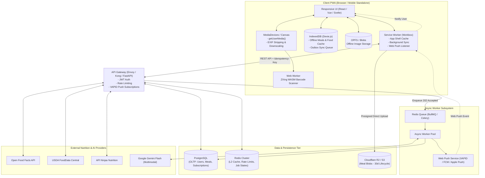
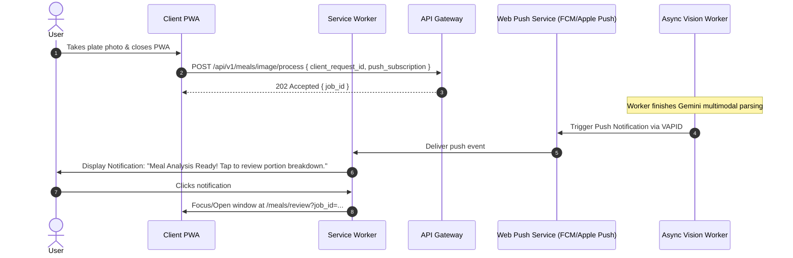

# RFC-001: Progressive Web App (PWA) Nutrition Calculation & Dietary Logging Engine

| Metadata | Specification |
| :--- | :--- |
| **Document ID** | RFC-001 |
| **Title** | Scalable, Offline-First PWA Nutrition Estimation & Logging Platform |
| **Author** | Tafadzwa Mudhuviwa |
| **Status** | Approved / Ready for Implementation |
| **Platform Target** | Progressive Web App (PWA) - Chromium (Android/Desktop) & WebKit (iOS 16.4+ Safari) |
| **Created** | 2026-09-07 |
| **Last Updated** | 2026-09-09 |
| **Target Release** | v1.0.0-MVP |

---

## 1. Executive Summary & Problem Statement

Accurate dietary tracking is bottlenecked by manual food logging friction and native app distribution barriers (app store gatekeeping, platform-specific codebases, and heavyweight download sizes). 

This platform delivers a zero-install, offline-first **Progressive Web App (PWA)** that provides instant access to a multimodal nutrition calculation engine supporting three primary ingestion modes:
1. **Computer Vision**: In-browser plate capture, visual segmentation, portion weight estimation, and macro/micronutrient breakdown via multimodal cloud inference.
2. **Natural Language Processing (NLP)**: Unstructured dietary notes (e.g., *"200g flank steak and 1.5 cups brown rice"*).
3. **Barcode Scanning**: Real-time camera viewfinder barcode recognition running client-side via hardware-accelerated Web APIs.

The core engineering focus is adapting high-performance native capabilities (hardware camera streams, background queue synchronization, offline image caching, and push notifications) to modern Web Standards (`ServiceWorker`, `IndexedDB`, `WebCodecs`/`BarcodeDetector`, `Web Push`, and `OPFS`).

---

## 2. Goals & Non-Goals

### 2.1 Goals
- **Cross-Platform PWA Delivery**: Single responsive codebase running across modern Chromium (Android, ChromeOS, Desktop) and iOS Safari (WebKit 16.4+ standalone mode).
- **Offline-First Resilience**: Full UI functionality, local meal history browsing, and offline photo/note capture backed by browser-managed `IndexedDB` and Service Worker caching.
- **Hardware-Accelerated Web Ingestion**:
  - In-browser barcode scanning via the native `BarcodeDetector` API with fallback to WebAssembly (`ZXing`/`zbar.wasm`) in a Web Worker.
  - Client-side EXIF stripping and canvas image downscaling to preserve mobile bandwidth.
- **Strict Performance Budgets**:
  - App Shell Interactive (TTI): $P_{95} < 1.2\text{s}$ on 4G networks
  - Barcode Resolution: $P_{95} < 150\text{ms}$
  - Text Parsing: $P_{95} < 600\text{ms}$
  - Visual Food Estimation: $P_{95} < 3.0\text{s}$ (asynchronous processing)
- **Cost Efficiency**: Keep average inference and ingestion costs below **\$0.003 per logged meal**.
- **Human-in-the-Loop Validation**: Transparent confidence scores, disambiguation dialogues, and continuous user overrides for portions and ingredients.

### 2.2 Non-Goals
- **App Store Native Binaries**: No Swift/Kotlin native wrappers or App Store/Google Play distribution in v1.0 (delivered entirely via web manifest installation).
- **Medical / Clinical Prescriptions**: Not building a certified medical device, insulin dosing calculator, or renal diet planner.
- **Continuous Live Video Stream Tracking**: Single-frame shutter capture only; no continuous multi-minute video processing.
- **Custom Foundation Model Training**: Leveraging foundation models (Gemini Flash) with strict schema decoding rather than training custom vision models.

---

## 3. Service Level Objectives (SLOs) & Reliability Targets

| Metric | Target | Measurement Window | Action on Violation |
| :--- | :--- | :--- | :--- |
| **PWA App Shell TTI (Lighthouse)** | $\le 1.5\text{s}$ | Cold load on 4G | Optimize bundle splitting, preload critical chunks |
| **Offline Sync Success Rate** | $\ge 99.95\%$ | Rolling 24 hours | Alert on sync queue buildup; inspect dead-letter store |
| **Core Logging Availability** | $\ge 99.9\%$ | Rolling 30 days | Escalate P1; fallback to client-side local cache |
| **Barcode Lookup Latency** | $P_{95} < 150\text{ms}$ | 5-minute rolling | Trip circuit breaker to secondary local index |
| **NLP Text Lookup Latency** | $P_{95} < 600\text{ms}$ | 5-minute rolling | Fail over from API Ninjas to USDA string search |
| **Vision Pipeline Latency** | $P_{95} < 3.0\text{s}$ | 15-minute rolling | Scale worker replicas; throttle non-essential tokens |

---

## 4. High-Level PWA Architecture Topology



---

## 5. PWA Platform Specifics & Web APIs

### 5.1 Web App Manifest Configuration (`manifest.webmanifest`)
Configures full-screen display, icons, and native OS integrations:

```json
{
  "name": "MacroTrack Nutrition Engine",
  "short_name": "MacroTrack",
  "description": "Multimodal AI Nutrition & Dietary Tracker",
  "start_url": "/?source=pwa",
  "display": "standalone",
  "orientation": "portrait",
  "background_color": "#121212",
  "theme_color": "#10b981",
  "icons": [
    {
      "src": "/icons/icon-192x192.png",
      "sizes": "192x192",
      "type": "image/png",
      "purpose": "any"
    },
    {
      "src": "/icons/icon-maskable-512x512.png",
      "sizes": "512x512",
      "type": "image/png",
      "purpose": "maskable"
    }
  ],
  "shortcuts": [
    {
      "name": "Scan Barcode",
      "url": "/scan?action=barcode",
      "icons": [{ "src": "/icons/barcode-shortcut.png", "sizes": "96x96" }]
    },
    {
      "name": "Capture Meal",
      "url": "/scan?action=photo",
      "icons": [{ "src": "/icons/camera-shortcut.png", "sizes": "96x96" }]
    }
  ],
  "share_target": {
    "action": "/share-meal",
    "method": "POST",
    "enctype": "multipart/form-data",
    "params": {
      "title": "meal_title",
      "files": [
        {
          "name": "meal_photo",
          "accept": ["image/jpeg", "image/png", "image/webp"]
        }
      ]
    }
  }
}
```

### 5.2 Storage Quotas & Persistence (`navigator.storage.persist()`)
Browsers evict IndexedDB data under storage pressure. iOS Safari historically evicts non-interacted PWA storage after 7 days unless persisted.
- On first interactive login, the PWA invokes:
  ```javascript
  if (navigator.storage && navigator.storage.persist) {
    const isPersisted = await navigator.storage.persist();
    console.log(`Storage persistent: ${isPersisted}`);
  }
  ```
- Guaranteed retention ensures offline meal queues and local food caches remain intact indefinitely.

### 5.3 In-Browser Camera & Barcode Ingestion
Unlike native apps that bundle heavy native vision SDKs (e.g. ML Kit), the PWA utilizes a tiered scanning pipeline:

```
[ Camera Stream: getUserMedia() ]
              │
              ▼
    [ BarcodeDetector API? ]
       ├── YES (Android Chrome/Edge) ──► Hardware-Accelerated Native Detection
       └── NO  (iOS Safari/Firefox)  ──► OffscreenCanvas Frame Capture
                                                    │
                                                    ▼
                                     [ Dedicated Web Worker ]
                                     ZXing / zbar.wasm (WASM)
                                     - No main thread UI jank (60 FPS)
```

1. **Primary**: Fast path via browser-native `window.BarcodeDetector` (supported on Chromium mobile).
2. **Fallback**: WebAssembly build of ZXing or ZBar instantiated inside an isolated Web Worker to prevent UI thread frame drops.
3. **Capture Mode for Meal Photos**:
   - Live interactive viewfinder via `navigator.mediaDevices.getUserMedia({ video: { facingMode: 'environment' } })`.
   - Fallback shutter via `<input type="file" accept="image/*" capture="environment">` for maximum compatibility on older mobile devices.

### 5.4 Client-Side Image Pre-Processing & EXIF Sanitization
Uploading raw 12MP phone photos (5–12MB) over cellular networks degrades latency and burns user mobile data. The PWA optimizes images on-device:

```javascript
async function prepareMealImageForUpload(file) {
  // 1. Draw image to offscreen canvas (automatically strips all EXIF GPS/device tags)
  const bitmap = await createImageBitmap(file);
  const maxDim = 1600; // Optimal resolution for Gemini Flash vision
  let { width, height } = bitmap;

  if (width > maxDim || height > maxDim) {
    const scale = maxDim / Math.max(width, height);
    width = Math.round(width * scale);
    height = Math.round(height * scale);
  }

  const canvas = new OffscreenCanvas(width, height);
  const ctx = canvas.getContext('2d');
  ctx.drawImage(bitmap, 0, 0, width, height);

  // 2. Compress to modern WebP (or fallback JPEG) at 82% quality (~250-400KB)
  const blob = await canvas.convertToBlob({ type: 'image/webp', quality: 0.82 });
  return blob;
}
```

---

## 6. Service Worker Caching & Offline Synchronization

### 6.1 Service Worker Caching Topology (Workbox)

| Resource Type | Routing Pattern | Strategy | Storage Engine | Invalidation / TTL |
| :--- | :--- | :--- | :--- | :--- |
| **App Shell** (HTML/JS/CSS) | `/_assets/*`, `/` | Stale-While-Revalidate | CacheStorage (`app-shell-v1`) | Automatic on SW update |
| **Product Icons & Badges** | `/icons/*`, `/static/*` | Cache-First | CacheStorage (`static-assets`) | 90 Days |
| **Barcode Lookup API** | `/api/v1/nutrition/barcode/*` | Network-First, IDB Fallback | CacheStorage + IndexedDB | 30 Days |
| **NLP Text Parsing** | `/api/v1/nutrition/parse-text` | Network-First | IndexedDB Local Hash | 14 Days |
| **Image Upload Queue** | `/api/v1/meals/image/*` | Network-Only | IndexedDB Outbox Queue | Process on reconnect |

### 6.2 Cross-Platform Offline Synchronization

Because browser platforms handle background synchronization differently, the PWA implements a **dual-mode sync engine**:

```mermaid
flowchart TD
    OfflineTrigger[User Logs Meal While Offline] --> WriteIDB[Write Record to IndexedDB outbox_queue]
    WriteIDB --> CheckPlatform{Browser Supports\nBackground Sync API?}
    
    CheckPlatform -- YES (Chrome / Android) --> RegisterSync[swRegistration.sync.register('sync-meals')]
    RegisterSync --> SWWait[Service Worker Wakes Up in Background When Online]
    SWWait --> DrainQueue[Drain Queue: Presigned Upload + API Commit]
    
    CheckPlatform -- NO (iOS Safari / Firefox) --> AttachListeners[Attach Foreground Listeners:\n- window.ononline\n- visibilitychange (visible)\n- app init boot]
    AttachListeners --> DetectOnline[User Opens App / Returns to Network]
    DetectOnline --> DrainQueue

    DrainQueue --> Complete[Update Local Meal State to 'SYNCED']
```

1. **Android / Chromium (Background Sync API)**:
   - Registers a `sync` event: `registration.sync.register('sync-meal-queue')`.
   - The OS wakes up the Service Worker even if the user closed the PWA tab once network connectivity returns.
2. **iOS Safari Fallback (Lifecycle Foreground Sync)**:
   - iOS does not support the Background Sync API.
   - Sync triggers on:
     - `window.addEventListener('online', ...)`
     - `document.addEventListener('visibilitychange', () => { if (document.visibilityState === 'visible') drainQueue(); })`
     - App startup boot check.
3. **Idempotency with UUIDv7**:
   - Meals created offline receive a client-generated UUIDv7 `client_request_id`.
   - Even if network interruptions cause duplicate sync flushes, the backend API Gateway deduplicates via the PostgreSQL idempotency table.

---

## 7. Asynchronous Notification Architecture (Web Push)

Visual meal estimation takes 2–4 seconds. In a web environment, mobile users often switch tabs or lock their phones immediately after taking a picture.

### 7.1 Web Push Delivery Flow
- **Standard**: W3C Web Push Protocol (RFC 8030) using VAPID (RFC 8292).
- **Supported Environments**: Desktop, Android Chrome, and **iOS 16.4+ (when installed to Home Screen)**.



---

## 8. Client Data Architecture: IndexedDB Schema (`Dexie.js`)

The PWA client manages local offline persistence via IndexedDB:

```typescript
import Dexie, { Table } from 'dexie';

export interface LocalMeal {
  id: string; // client_request_id (UUIDv7)
  meal_type: 'BREAKFAST' | 'LUNCH' | 'DINNER' | 'SNACK';
  status: 'PENDING_SYNC' | 'SYNCED' | 'PENDING_REVIEW';
  consumed_at: string;
  total_calories: number;
  total_protein: number;
  total_carbs: number;
  total_fat: number;
  items: Array<{
    name: string;
    weight_g: number;
    calories: number;
    protein_g: number;
    carbs_g: number;
    fat_g: number;
    source: 'BARCODE' | 'NLP' | 'VISION' | 'MANUAL';
  }>;
}

export interface OutboxQueueItem {
  id?: number;
  client_request_id: string;
  action: 'CREATE_MEAL_TEXT' | 'CREATE_MEAL_IMAGE' | 'SCAN_BARCODE';
  payload: any;
  image_blob?: Blob; // Stored offline if image captured without network
  created_at: number;
  retry_count: number;
}

export class NutritionPwaDatabase extends Dexie {
  meals!: Table<LocalMeal, string>;
  outbox_queue!: Table<OutboxQueueItem, number>;
  cached_foods!: Table<any, string>;

  constructor() {
    super('NutritionPwaDB');
    this.version(1).stores({
      meals: 'id, consumed_at, status, meal_type',
      outbox_queue: '++id, client_request_id, action, created_at',
      cached_foods: 'barcode, normalized_name'
    });
  }
}

export const db = new NutritionPwaDatabase();
```

---

## 9. Detailed Ingestion Pipelines

### 9.1 Barcode Scanning Pipeline (Client PWA)
1. **L1 (Client IndexedDB Cache)**: Checks `cached_foods` in IndexedDB ($<5\text{ms}$).
2. **L2 (Distributed Redis)**: API Gateway check on `cache:barcode:{gtin}` ($TTL = 30\text{ days}$).
3. **L3 (Server Database)**: Pre-indexed Open Food Facts / USDA foundation dumps.
4. **External L4 (Open Food Facts API)**: Upstream REST query.
5. **Fallback L5 (USDA FoodData Central)**: Upstream branded foods query.

### 9.2 NLP Text Ingestion Pipeline
1. Client normalizes text string (lower case, unicode fraction expansion).
2. Computes SHA-256 hash in-browser via `crypto.subtle.digest('SHA-256', ...)`.
3. If offline, queues payload in `outbox_queue`.
4. If online, routes to `/api/v1/nutrition/parse-text`:
   - Primary: **API Ninjas Nutrition**
   - Fallback: **USDA FoodData Central**
   - Resilient Fallback: **Gemini Flash Structured Text Extraction**

### 9.3 Multimodal Visual Plating Pipeline
1. Client acquires photo (via `getUserMedia` or file input).
2. Canvas resizes to max 1600px and strips all EXIF metadata.
3. If offline:
   - Image Blob is serialized directly into IndexedDB `outbox_queue`.
   - UI reflects an "Offline Meal Draft (Pending Sync)" state.
4. When online:
   - Requests presigned upload URL from `/api/v1/meals/image/presigned-url`.
   - Direct `PUT` upload from browser to Cloudflare R2 / S3.
   - Enqueues job via `POST /api/v1/meals/image/process`.
   - Receives `202 Accepted` with `job_id`.
   - Polls via SSE or waits for Service Worker Web Push notification if tab is dismissed.

---

## 10. Human-in-the-Loop (HITL) PWA User Experience

To guarantee user trust despite visual estimation tolerances, the PWA implements an intuitive touch-first review flow:

```
[ Camera Capture ] ──► [ Canvas Optimization ] ──► [ Async Cloud Worker ]
                                                             │
                                                             ▼
                                                [ Interactive Review UI ]
                                                ├── Bounding Boxes on Canvas Overlay
                                                ├── Portion Sliders (grams / oz)
                                                └── Ambiguity Chip Selectors
                                                             │
                                                             ▼
                                                [ Confirm & Sync to History ]
```

1. **Canvas Bounding Box Overlays**: The detected items and their normalized 2D bounding boxes (`[ymin, xmin, ymax, xmax]`) are drawn on an HTML5 `<canvas>` over the meal image, allowing the user to tap directly on a food item to edit its details.
2. **Confidence-Driven UI**:
   - `confidence >= 0.85`: Rendered with green verification badges.
   - `0.50 <= confidence < 0.85`: Highlighted in amber; prompts portion confirmation.
   - `confidence < 0.50` or `is_ambiguous = true`: Triggers a bottom-sheet selection drawer (*"Is this Teriyaki, BBQ, or Gravy?"*).
3. **Reactive Gram Sliders**: Sliders allow users to tweak weights in 5g increments; client dynamically recalculates macros locally without server re-queries.

---

## 11. Backend API Specifications & Contracts

### 11.1 Barcode Lookup
`GET /api/v1/nutrition/barcode/{code}`

```json
{
  "code": "0737628064502",
  "name": "Thai Peanut Sauce",
  "brand": "Thai Kitchen",
  "serving_size_g": 30.0,
  "nutrients_per_serving": {
    "calories": 70.0,
    "protein_g": 2.0,
    "carbs_g": 9.0,
    "fat_g": 3.0,
    "fiber_g": 1.0,
    "sodium_mg": 210.0
  },
  "source": "OPEN_FOOD_FACTS"
}
```

### 11.2 Text NLP Parsing
`POST /api/v1/nutrition/parse-text`

```json
// Request
{
  "query": "200g grilled salmon and 1 cup steamed broccoli",
  "client_request_id": "0191c95b-7a30-74e4-b529-6799d5ba010a"
}

// Response (200 OK)
{
  "total_nutrients": {
    "calories": 466.0,
    "protein_g": 43.6,
    "carbs_g": 6.0,
    "fat_g": 26.8
  },
  "items": [
    {
      "raw_text": "200g grilled salmon",
      "matched_name": "Atlantic Salmon, Grilled",
      "weight_g": 200.0,
      "calories": 412.0,
      "protein_g": 40.0,
      "carbs_g": 0.0,
      "fat_g": 26.0
    }
  ]
}
```

### 11.3 Multimodal Image Estimation & Web Push Subscription
`POST /api/v1/meals/image/process`

```json
// Request
{
  "client_request_id": "0191c95e-3990-7d72-9a3b-2802bcfb17ce",
  "image_blob_key": "raw-meals/0191c95e-3990-7d72.webp",
  "meal_type": "LUNCH",
  "client_timestamp": "2026-09-09T13:45:00Z",
  "push_subscription": {
    "endpoint": "https://fcm.googleapis.com/fcm/send/...",
    "keys": {
      "p256dh": "BNcR...",
      "auth": "tBH..."
    }
  }
}

// Response (202 Accepted)
{
  "job_id": "job_0191c95e_89ef7b2c",
  "status": "QUEUED",
  "poll_url": "/api/v1/jobs/job_0191c95e_89ef7b2c",
  "estimated_duration_seconds": 2.5
}
```

---

## 12. Security, Privacy & Compliance

1. **HTTPS Enforcement**: PWAs mandate strict TLS (HTTPS) for Service Worker registration, Web Push, and `getUserMedia()` camera access.
2. **Client-Side EXIF Scrubbing**: All location coordinates (`GPSLatitude`/`GPSLongitude`) and hardware identifiers are removed via the canvas transformation step before any bytes leave the user's browser.
3. **Enterprise Zero Data Retention (ZDR)**: Multimodal inference through Gemini Flash operates under GCP Commercial Terms ensuring meal photos are not retained or utilized for model training.
4. **Statutory Nutrition Disclaimer**: Displayed prominently in PWA settings and onboarding:
   > *"Nutrition calculations provided by this application are computational estimates and do not constitute clinical or medical dietary advice."*

---

## 13. Unit Economics & Infrastructure Sizing

Targeting **50,000 Daily Active Users (DAU)** logging an average of 3 meals per day:

| Infrastructure Component | Workload Units / Day | Unit Pricing | Monthly Cost |
| :--- | :--- | :--- | :--- |
| **PWA Static Hosting** (Vercel / Cloudflare Pages) | ~500k page/asset requests | Free / Pro Plan | \$20.00 |
| **Open Food Facts API** | 3,000 non-cached queries | Open Source Mirror | \$0.00 |
| **API Ninjas Nutrition** | 15,750 non-cached queries | Enterprise Tier | \$99.00 |
| **Gemini Flash Vision** | 37,500 meal images | \$0.00035 / call | \$393.90 |
| **Cloudflare R2 Object Storage** | 37.5k WebP images $\times$ 350KB = 13.1GB/day (30-day rolling = 400GB) | \$0.015/GB-mo (Zero egress) | \$6.00 |
| **PostgreSQL & Redis Managed Tier** | Multi-AZ High Availability | Cloud Compute | \$280.00 |
| **Web Push Dispatcher** | ~40k push events/day | Open Protocol (RFC 8030) | \$0.00 |
| **Total Monthly Operating Cost** | | | **\$798.90 / mo** |

$$\text{Cost per meal logged} = \frac{\$798.90}{4,500,000\text{ meals/month}} = \mathbf{\$0.000177} \ll \mathbf{\$0.003}\text{ (Target Achieved)}$$

---

## 14. Architecture Comparison: Native App vs. Progressive Web App

| Feature Area | Native Mobile (iOS / Android) | Progressive Web App (PWA) Decision |
| :--- | :--- | :--- |
| **Installation & Distribution** | App Store / Google Play review delays; ~50MB app download | Instant access via URL; installable to home screen via Web Manifest ($<2\text{MB}$) |
| **Local Storage** | SQLite / Room / CoreData | **IndexedDB** (`Dexie.js`) + Cache Storage API + `navigator.storage.persist()` |
| **Camera Access** | AVFoundation / CameraX | `navigator.mediaDevices.getUserMedia()` with fallback to `<input capture="environment">` |
| **Barcode Scanner** | Google ML Kit (native C++) | Hardware **`BarcodeDetector` API** with **ZXing WebAssembly** Web Worker fallback |
| **Background Offline Sync** | Android `WorkManager` & iOS `BGAppRefreshTask` | **Background Sync API** (Android) + Foreground Lifecycle (`online`, `visibilitychange`) on iOS Safari |
| **Push Notifications** | Apple APNs & Google FCM SDKs | **Web Push API** (W3C standard with VAPID; supported on iOS 16.4+ standalone PWAs) |
| **Image Compression & Privacy** | Native bitmap manipulation | In-browser **`OffscreenCanvas`** (auto-strips EXIF tags & compresses to WebP) |
| **Update Mechanism** | App Store update approval cycle | Instant rolling Service Worker cache updates (`stale-while-revalidate`) |
